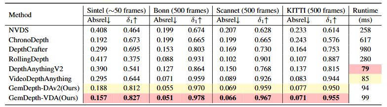

<div align="center">
<h2 align="center"> GemDepth: Geometry-Embedded Features for 3D-Consistent Video Depth </h2>

[**Yuecheng liu**](https://github.com/Yuecheng919/)<sup>1</sup>, [**Junda Cheng**](https://github.com/Junda24)<sup>1*</sup>, [**Wenjing Liao**](https://github.com/waldeinsamkeits)<sup>1,2</sup>, [**Hanrui Cheng**](https://github.com/MarcelRay0312)<sup>1,2</sup>, [**Yuzhou Wang**](https://github.com/YuzhouWang999)<sup>1</sup>, [**Xin Yang**](https://sites.google.com/view/xinyang/home)<sup>1,3</sup>
<br><br>
<sup>*</sup>Corresponding Author
<br>
<sup>1</sup>Hust, <sup>2</sup>Carizon, <sup>3</sup>Optics Valley Laboratory
  <h5>If you like our project, please give us a star ⭐ on GitHub for the latest updates!</h5>
  
  [](https://huggingface.co/YuechengLiu/GemDepth) [](https://arxiv.org/abs/2605.10525)
</div>


## 📢 News
- **[2026.05.09]** 🔥 GemDepth is out! It effectively recovering fine-grained
details and has better 3D temporal consistency.


## 👋 Introduction

Welcome to the official repository for **GemDepth**! 

GemDepth is a framework built on the insight that an explicit awareness of camera motion and global 3D structure is a prerequisite for 3D consistency. Distinctively, GemDepth introduces a Geometry-Embedding Module (GEM) that predicts inter-frame camera poses to generate implicit geometric embeddings. This injection of motion priors equips the network with intrinsic 3D perception and alignment capabilities. Guided by these geometric cues, our Alternating Spatio-Temporal Transformer (ASTT) captures latent point-level correspondences to simultaneously enhance spatial precision for sharp details and enforce rigorous temporal consistency.

GemDepth achieves stateof-the-art performance across multiple datasets,
particularly in complex dynamic scenarios.


##  📝 Benchmarks performance


Comparisons with state-of-the-art methods across four of the most widely used benchmarks.
## ⏳ Usage

### Preparation
```Shell
git clone https://github.com/Yuechengliu919/GemDepth
cd GemDepth
conda create -n gemdepth python=3.10
conda activate gemdepth
pip install -r requirements.txt
```

### Use our model
```bash
import torch
from model.gemdepth import GemDepth
DEVICE = 'cuda' if torch.cuda.is_available() else 'cpu'
model_configs = {
    'vits': {'encoder': 'vits''features': 64, 'out_channels': [4896, 192, 384]},
    'vitl': {'encoder': 'vitl''features': 256, 'out_channels'[256, 512, 1024, 1024]},
}
gemdepth = GemDepth(**model_configs[argencoder])
checkpoint = torch.load("./checkpoint/gemdepth.pth",map_location='cpu',weights_only=False)
gemdepth.load_state_dict(checkpoint,strict=True)
gemdepth = gemdepth.to(DEVICE).eval()
frames, target_fps = read_video_frames(video_path, args.max_len, args.target_fps, 1280)
depths, fps = gemdepth.infer_video_depth(frames, target_fps, input_size=args.input_size,device=DEVICE, fp32=args.fp32)

```

### Running script on video
```bash
# run script on video
python run_video.py --input_dir ./assets/example_videos --output_dir ./assets/example_result  
```

## ✏️ Training Data
* [TartanAir](https://github.com/castacks/tartanair_tools)
* [VKITTI](https://europe.naverlabs.com/research/computer-vision/proxy-virtual-worlds-vkitti-1)
* [VKITTI2](https://europe.naverlabs.com/proxy-virtual-worlds-vkitti-2)
* [PointOdyssey](https://github.com/y-zheng18/point_odyssey)
* [MVS-Synth](https://phuang17.github.io/DeepMVS/mvs-synth.html)
* [Dynamic Replica](https://github.com/facebookresearch/dynamic_stereo)
* [IRS](https://github.com/HKBU-HPML/IRS)

## ✈️ Model weights

| Model      |                                               Link                                                |
|:----:|:-------------------------------------------------------------------------------------------------:|
| GemDepth| [Download 🤗](https://huggingface.co/YuechengLiu/GemDepth/resolve/main/gemdepth.pth?download=true) |

## ✈️ Evaluation

### Prepare Evaluation Datasets
Follow [VideoDepthAnything](https://github.com/DepthAnything/Video-Depth-Anything/tree/main), download datasets from the following links:
[Sintel](http://sintel.is.tue.mpg.de/), [KITTI](https://www.cvlibs.net/datasets/kitti/), [Bonn](https://www.ipb.uni-bonn.de/data/rgbd-dynamic-dataset/index.html), [ScanNet](http://www.scan-net.org/)

```bash
pip install natsort
cd dataset/dataset_extract
python dataset_extrtact${dataset}.py
```
This script will extract the dataset to the `dataset/dataset_extract/dataset` folder. It will also generate the json file for the dataset.

### Run inference
```bash
python evaluation/inference/infer/infer.py \
    --infer_path ${out_path} \
    --json_file ${json_path} \
    --datasets ${dataset}
```
Options:
- `--infer_path`: path to save the output results
- `--json_file`: path to the json file for the dataset, like `sintel_video.json`, `kitti_video_500.json`, `scannet_video_tae.json`
- `--datasets`: dataset name, choose from `sintel`, `kitti`, `bonn`, `scannet`

### Run evaluation
```bash
## ~500frame 
python evaluation/eval/eval.py \
    --infer_path ${pred_root} \
    --benchmark_path ${benchmark_root} \
    --datasets ${dataset}
```

## ✈️ Training
To train GemDepth on mix-datasets, run
```Shell
## stage1
CUDA_VISIBLE_DEVICES=0,1,2,3,4,5,6,7 accelerate launch train.py --config-name stage1
## stage2
CUDA_VISIBLE_DEVICES=0,1,2,3,4,5,6,7 accelerate launch train.py --config-name stage2
```


