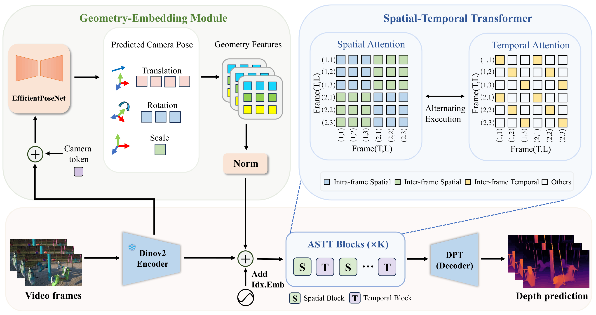
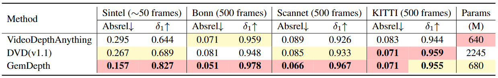
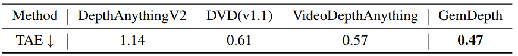

<div align="center">
<h2 align="center"> GemDepth: Geometry-Embedded Features for 3D-Consistent Video Depth </h2>

[**Yuecheng liu**](https://github.com/Yuecheng919/)<sup>1</sup>, [**Junda Cheng**](https://github.com/Junda24)<sup>1†</sup>, [**Longliang Liu**](https://github.com/longliangLiu)<sup>1,2</sup>, [**Wenjing Liao**](https://github.com/waldeinsamkeits)<sup>1,2</sup>, [**Hanrui Cheng**](https://github.com/MarcelRay0312)<sup>1,2</sup>, [**Yuzhou Wang**](https://github.com/YuzhouWang999)<sup>1</sup>, [**Xin Yang**](https://sites.google.com/view/xinyang/home)<sup>1,3</sup>
<br><br>
<sup>†</sup>Corresponding Author
<br>
<sup>1</sup>Hust, <sup>2</sup>Carizon, <sup>3</sup>Optics Valley Laboratory
  <h5>If you like our project, please give us a star ⭐ on GitHub for the latest updates!</h5>
  
 [](https://r11031.github.io/website/) [](https://huggingface.co/YuechengLiu/GemDepth) [](https://arxiv.org/abs/2605.10525)
</div>

## 🤗 Demo Video

<div align="center">
  <a href="https://www.youtube.com/watch?v=o6Z2p-P9hSE">
    
  </a>
</div>

## 📢 News
- **[2026.06.29]** 🔥🔥🔥 Add comparisons with the recent generative video depth method [DVD](https://github.com/EnVision-Research/DVD), showing that GemDepth achieves superior spatial accuracy and temporal consistency.
- **[2026.05.18]** 🤗🤗🤗 Evaluation datasets released on Hugging Face.
- **[2026.05.16]** 🤗🤗🤗 Hugging Face Gradio demos released.
- **[2026.05.16]** Add GPU memory adjustment schemes for inference and training.
- **[2026.05.15]** 🤗🤗🤗Pre-trained weights released on Hugging Face.
- **[2026.05.14]** Add [`run_video_pointcloud`](https://github.com/Yuecheng919/GemDepth/evaluation/inference/run_video_pointcloud) for pointcloud reconstruction.
- **[2026.05.09]** 🔥🔥🔥GemDepth is out! It effectively recovering fine-grained
details and has better 3D temporal consistency.


## 👋 Introduction

Welcome to the official repository for **GemDepth**! 

GemDepth is a framework built on the insight that an explicit awareness of camera motion and global 3D structure is a prerequisite for 3D consistency. Distinctively, GemDepth introduces a Geometry-Embedding Module (GEM) that predicts inter-frame camera poses to generate implicit geometric embeddings. This injection of motion priors equips the network with intrinsic 3D perception and alignment capabilities. Guided by these geometric cues, our Alternating Spatio-Temporal Transformer (ASTT) captures latent point-level correspondences to simultaneously enhance spatial precision for sharp details and enforce rigorous temporal consistency.

GemDepth achieves state of-the-art performance across multiple datasets,
particularly in complex dynamic scenarios.



##  📝 Benchmarks performance
<p align="center">
  
</p>

<p align="center">
  
</p>

Comparisons with state-of-the-art methods across four widely used benchmarks show that GemDepth consistently achieves superior performance in both spatial accuracy and temporal consistency. All evaluations follow the same protocol and metrics adopted in VideoDepthAnything to ensure a fair comparison. Compared with previous discriminative methods [VideoDepthAnything](https://github.com/DepthAnything/Video-Depth-Anything/), as well as recent generative approaches [DVD](https://github.com/EnVision-Research/DVD), GemDepth delivers the best overall results, demonstrating its effectiveness in producing accurate and temporally stable depth predictions for complex dynamic scenes.
## ⏳ Usage

### Preparation
```Shell
git clone https://github.com/Yuechengliu919/GemDepth
cd GemDepth
conda create -n gemdepth python=3.10
conda activate gemdepth
pip install -r requirements.txt
```

### Model weights

| Model      |                                               Link                                                |
|:----:|:-------------------------------------------------------------------------------------------------:|
| GemDepth| [Download 🤗](https://huggingface.co/YuechengLiu/GemDepth/resolve/main/gemdepth.pth?download=true) |

The final structure shoule be like
```
GemDepth
├── checkpoint/
├──── gemdepth.pth
├── configs/
├── model/
├── ...
```

### Use our model
```bash
import torch
from model.gemdepth import GemDepth
DEVICE = 'cuda' if torch.cuda.is_available() else 'cpu'
model_configs = {
    'vits': {'encoder': 'vits''features': 64, 'out_channels': [4896, 192, 384]},
    'vitl': {'encoder': 'vitl''features': 256, 'out_channels'[256, 512, 1024, 1024]},
}
gemdepth = GemDepth(**model_configs[argencoder])
checkpoint = torch.load("./checkpoint/gemdepth.pth",map_location='cpu',weights_only=False)
gemdepth.load_state_dict(checkpoint,strict=True)
gemdepth = gemdepth.to(DEVICE).eval()
frames, target_fps = read_video_frames(video_path, args.max_len, args.target_fps, 1280)
depths, fps = gemdepth.infer_video_depth(frames, target_fps, input_size=args.input_size,device=DEVICE, fp32=args.fp32)

```

### Running script on video
```bash
# Only video depth output
python evaluation/inference/run_video.py --input_dir ./assets/example_videos --output_dir ./assets/example_result
# video depth & pointcloud output
python evaluation/inference/run_video_pointcloud.py --input_dir ./assets/example_videos --output_dir ./assets/example_result  
```
Tips: If GPU memory is insufficient, you can adjust the infer settings in `model/gemdepth.py`. The default settings are:
```bash
INFER_LEN = 32
OVERLAP = 10
KEYFRAMES = [0, 12, 24, 25, 26, 27, 28, 29, 30, 31]
INTERP_LEN = 8
```
which require about 44GB GPU memory. You can reduce them as follows:
```bash
INFER_LEN = 16
OVERLAP = 6
KEYFRAMES = [0, 6, 12, 13, 14, 15]
INTERP_LEN = 4
```
which require about 25GB GPU memory, or:
```bash
INFER_LEN = 8
OVERLAP = 4
KEYFRAMES = [0, 3, 6, 7]
INTERP_LEN = 2
```
which require about 15GB GPU memory. You can adjust these parameters according to your GPU memory.

### Interactive Demo

We provide an interactive Gradio interface for you to easily test GemDepth on your own videos without writing any code.

```bash
pip install -r demo/requirements.txt
python demo/app.py
```
Our Gradio-based interface allows you to upload videos, run video depth prediction and pointcloud reconstruction, and interactively explore the 3D scene in your browser.

## ✏️ Training Data
* [TartanAir](https://github.com/castacks/tartanair_tools)
* [VKITTI](https://europe.naverlabs.com/research/computer-vision/proxy-virtual-worlds-vkitti-1)
* [VKITTI2](https://europe.naverlabs.com/proxy-virtual-worlds-vkitti-2)
* [PointOdyssey](https://github.com/y-zheng18/point_odyssey)
* [MVS-Synth](https://phuang17.github.io/DeepMVS/mvs-synth.html)
* [Dynamic Replica](https://github.com/facebookresearch/dynamic_stereo)
* [IRS](https://github.com/HKBU-HPML/IRS)

## ✈️ Evaluation

### Prepare Evaluation Datasets
| Datasets      |                                               Link                                                |
|:----:|:-------------------------------------------------------------------------------------------------:|
| Sintel| [Download 🤗](https://huggingface.co/datasets/YuechengLiu/test_datasets/resolve/main/sintel.tar.gz?download=true) |
| KITTI| [Download 🤗](https://huggingface.co/datasets/YuechengLiu/test_datasets/resolve/main/kitti.tar.gz?download=true) |
| Bonn| [Download 🤗](https://huggingface.co/datasets/YuechengLiu/test_datasets/resolve/main/bonn.tar.gz?download=true) |
| Scannet| [Download 🤗](https://huggingface.co/datasets/YuechengLiu/test_datasets/resolve/main/scannet.tar.gz?download=true) |

You can directly download the evaluation datasets via the link above, or follow the preprocessing steps below.

Follow [VideoDepthAnything](https://github.com/DepthAnything/Video-Depth-Anything/), download raw datasets from the following links:
[Sintel](http://sintel.is.tue.mpg.de/), [KITTI](https://www.cvlibs.net/datasets/kitti/), [Bonn](https://www.ipb.uni-bonn.de/data/rgbd-dynamic-dataset/index.html), [ScanNet](http://www.scan-net.org/)

```bash
pip install natsort
cd dataset/dataset_extract
python dataset_extrtact${dataset}.py
```
This script will extract the dataset to the `dataset/dataset_extract/dataset` folder. It will also generate the json file for the dataset.

### Run inference
```bash
python evaluation/inference/infer/infer.py \
    --infer_path ${out_path} \
    --json_file ${json_path} \
    --datasets ${dataset}
```
Options:
- `--infer_path`: path to save the output results
- `--json_file`: path to the json file for the dataset, like `sintel_video.json`, `kitti_video_500.json`, `scannet_video_tae.json`
- `--datasets`: dataset name, choose from `sintel`, `kitti`, `bonn`, `scannet`

### Run evaluation
```bash
## ~500frame 
python evaluation/eval/eval.py \
    --infer_path ${pred_root} \
    --benchmark_path ${benchmark_root} \
    --datasets ${dataset}
```

## ✈️ Training
To train GemDepth on mix-datasets, run
```Shell
## stage1
CUDA_VISIBLE_DEVICES=0,1,2,3,4,5,6,7 accelerate launch train.py --config-name stage1
## stage2
CUDA_VISIBLE_DEVICES=0,1,2,3,4,5,6,7 accelerate launch train.py --config-name stage2
```
Tips: If GPU memory is insufficient, you can adjust `seq_len` in the config file.

## ✈️ Citation

If you find our works useful in your research, please consider citing our papers:

```bibtex

@inproceedings{Liu2026GemDepthGF,
  title={GemDepth: Geometry-Embedded Features for 3D-Consistent Video Depth},
  author={Yuecheng Liu and Junda Cheng and Longliang Liu and Wenjing Liao and Hanrui Cheng and Yuzhou Wang and Xin Yang},
  year={2026},
  url={https://api.semanticscholar.org/CorpusID:288258595}
}

```

## ⭐Star History

<a href="https://www.star-history.com/?repos=Yuecheng919%2FGemDepth&type=date&legend=top-left">
 <picture>
   <source media="(prefers-color-scheme: dark)" srcset="https://api.star-history.com/chart?repos=Yuecheng919/GemDepth&type=date&theme=dark&legend=top-left" />
   <source media="(prefers-color-scheme: light)" srcset="https://api.star-history.com/chart?repos=Yuecheng919/GemDepth&type=date&legend=top-left" />
   
 </picture>
</a>

## 👏Acknowledgements

This project is based on [VideoDepthAnything](https://github.com/DepthAnything/Video-Depth-Anything/)、[VGGT](https://github.com/facebookresearch/vggt) and [DepthAnythingV2](https://github.com/DepthAnything/Depth-Anything-V2). We thank the original authors for their excellent works.
